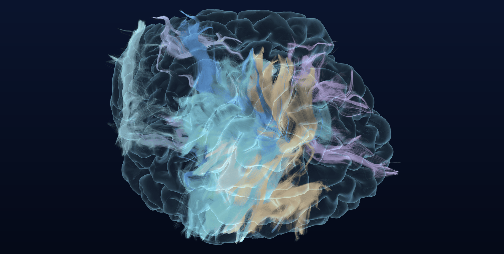

My own brain. 55 white-matter bundles from my 3T diffusion MRI, sitting inside my own cortical surface. GQI reconstruction, bundles labelled against the HCP842 atlas, rendered with a NumPy rasteriser I wrote.

# Donovan Santine

Biomedical engineering at UT Austin. I build brain-computer interfaces, the
neuroimaging pipelines that feed them, and infrastructure for autonomous agents.

Most of my week is EEG and diffusion MRI. The rest is backend work, usually
because a pipeline needed something that did not exist yet.

[INIaustin.org](https://iniaustin.org) | [moltgrid.net](https://moltgrid.net) | [Interactive card](https://d0nmega.github.io/card) | [LinkedIn](https://linkedin.com/in/donovan-santine)

## Brain-computer interfaces

[**Fable**](https://github.com/LonghornNeurotech/Fable) decodes meaning instead of
motor intent, reading the N400 event-related potential while a story unfolds.
Built in 48 hours by a team of five at Global NeuroHack 2026 in San Francisco,
where it placed 2nd internationally. There is a [live demo](https://fable-snowy.vercel.app).

[**Longhorn Neural Interface Platform**](https://github.com/LonghornNeurotech/GUI)
is Longhorn Neurotech's desktop EEG application, covering acquisition, DSP, model
training and deployment. 35 released builds so far, currently v1.46, with
separate macOS and Windows artifacts and an in-app updater. Supports the g.tec
Unicorn Hybrid Black over native BLE, OpenBCI Cyton, Myo, and BrainFlow. I am the
top contributor, with 80 of its 121 commits.

[**ssvep-device-control**](https://github.com/D0NMEGA/ssvep-device-control) is a
real-time SSVEP interface: 250 ms decision windows, above 90 percent accuracy
across 4 degrees of freedom.

## Neuroimaging

The image at the top is my own scan. The pipeline behind it takes preprocessed
multi-shell diffusion data (b = 0 through 3000, 96 directions, 1.7 mm isotropic),
reconstructs it with GQI, tracks 600,000 streamlines, and recovers 55 named
bundles by atlas recognition. The renderers are pure NumPy with no GPU and no 3D
library: depth-slab compositing so near fibres occlude far ones, illuminated
streamline shading so bundles read as tubes rather than ribbons, and a vectorised
z-buffer that gets its depth test for free from sorting samples far to near.

That imagery is the hero of [INIaustin.org](https://iniaustin.org), the site for
the UT Austin chapter of the Institute of Neuro Innovation, which is the second
chapter after UCLA.

Alongside that I work on MRI preprocessing infrastructure (dcm2bids through
MRIQC, fMRIPrep, QSIPrep, ASLPrep and QSMxT) and first-author exposome research
at the REACH Equity Lab, with an abstract accepted to ISES 2026 in the machine
learning session.

## Infrastructure

[**MoltGrid**](https://github.com/D0NMEGA/MoltGrid) is a backend-as-a-service for
autonomous agents: memory, task queues, inter-agent messaging, scheduling and
vector search behind one API. FastAPI, PostgreSQL and Redis, 245 routes, 780
tests, Apache 2.0. It ships typed SDKs for
[Python](https://github.com/D0NMEGA/moltgrid-py) and
[JavaScript](https://github.com/D0NMEGA/moltgrid-js), plus an
[MCP server](https://github.com/D0NMEGA/moltgrid-mcp) so agents can call it
natively.

[**donnyclaude**](https://github.com/D0NMEGA/donnyclaude) is a workflow engine for
Claude Code: durable project state, phase planning, and completion gates that
fail rather than wave work through. 94 skills, 48 agents, 63 commands and 32
hooks, installed with one command. v3.2.0 on npm, MIT.

## Other things I have built

- [The card](https://d0nmega.github.io/card), a draggable fsaverage5 cortical mesh that heat-maps when you pick an emotion, using MNI coordinates taken from published meta-analyses rather than invented.
- [Infinite Hallway](https://d0nmega.github.io), a procedurally generated corridor that re-centres the whole scene every 2000 units so it never runs out of floating point.
- [polaroids-for-mom](https://github.com/D0NMEGA/polaroids-for-mom), a macOS screensaver of polaroids scattered on a wooden table. A Mother's Day gift, packaged so it never makes a network call.
- [synq](https://github.com/D0NMEGA/synq), emotion-scored ad creative that re-optimises against viewer sentiment.
